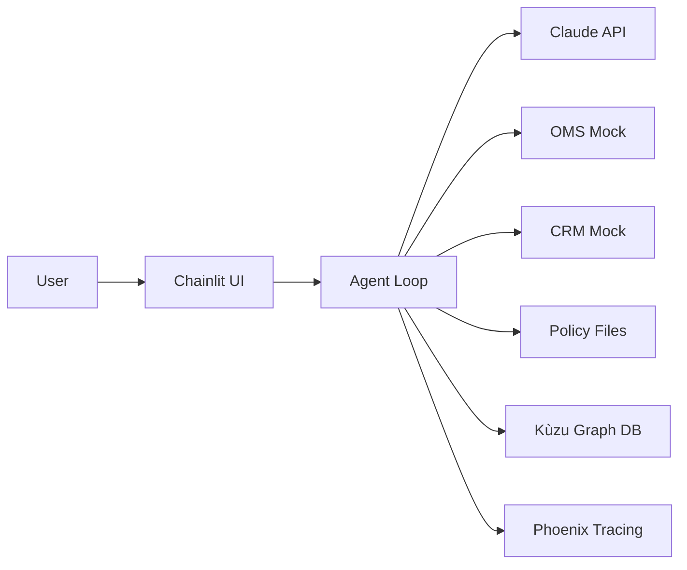

# Engineering Determinism: Why I Built my CX Agent without Frameworks

**Date:** 2026-01-21
**Series:** Building an Enterprise CX Agent (Part 1 of 6)
**Category:** AI-Native Workflows
**Tags:** #ai-native #solutions-engineering #anthropic #systems-design

---

## The Bottleneck

Most "agent" demos I see lately are fragile. They're usually just thin wrappers around a chat prompt that hallucinate their way through a tool call. If you're building for the enterprise, "vibes-based" engineering doesn't scale.

Over the recent break, I spent a two-week block building a Customer Support returns agent from scratch. I didn't want a chatbot; I wanted a deterministic engine that could handle a refund workflow without drifting off-script.

## Project Overview

**The Scenario:**
A customer wants to return socks they purchased three weeks ago. Your support agent needs to check:
1. Order Management System: Is the order valid? What's the return eligibility status?
2. Return Policy: Are socks even returnable? (Spoiler: They're marked "Final Sale")
3. CRM: Is this a VIP customer? How long have they been with us?
4. Decision Ledger: Has leadership approved exceptions like this before?

A human agent handles this in 10 minutes by checking three systems and using judgment. An AI agent that just "vibes" through this workflow will either approve everything (policy violations) or deny everything (VIP churn).

**What I Built:**
An agent that orchestrates this workflow deterministically:
- **Tool-first design:** The agent cannot refund until it physically confirms policy compliance
- **Conflict resolution:** When the OMS says "eligible" but policy says "Final Sale," the agent escalates to VIP check
- **Precedent matching:** For VIPs denied by policy, it queries a graph database for historical exceptions
- **Full auditability:** Every decision logged with session ID, tool calls, and reasoning

This isn't a chatbot that answers questions. It's a workflow engine that happens to use natural language as the interface.

## The AI Stack

To build this workflow engine, I needed to see how all the pieces would fit together before choosing specific tools. Here's the architecture:

**System Architecture:**

The agent loop sits at the center, orchestrating calls to Claude for reasoning and tools for data retrieval.

With the architecture in mind, each component choice optimized for a specific constraint:

**Core Components & Rationale:**

**1. LLM: Claude Sonnet 4.5 (Anthropic)**
- Temperature 0.0 for bitwise-identical outputs
- 200K context window (fits entire conversation history + policy docs)
- Tool use reliability (critical for orchestration)

**2. UI: Chainlit (localhost:8000)**
- Built-in session management (no auth boilerplate)
- Chat profiles (customer mode vs. admin audit mode)
- Production-ready WebSocket handling

**3. Database: Kùzu (embedded graph DB)**
- No external service (entire DB is a single file)
- Cypher query support (familiar syntax for precedent matching)
- Demo works offline (critical for POVs in air-gapped environments)

**4. Observability: Arize Phoenix + OpenTelemetry (localhost:6006)**
- Self-hosted (no data egress to external SaaS)
- Auto-instruments Claude API calls
- Waterfall traces show exact LLM thinking → tool call → result flow

**5. Backend: Python 3.10+ with mock services**
- OMS, CRM, Payment mocks (reproducible demos)
- No customer staging environment dependencies
- Fast iteration (no API rate limits or auth tokens)

## The Architecture

With the problem and scope defined, the first architectural decisions came into focus.

### The Decision to go Native
The first two days were almost entirely architectural. The biggest question was whether to use a framework like LangGraph or PydanticAI.

**The Trade-off:**
Frameworks give you speed—a "Hello World" agent in ten minutes. But they abstract away the message history and tool execution details. For enterprise POVs, that's a problem. When a compliance officer asks "Show me exactly why the agent approved this exception," I can't point to a framework's black box.

Going native with the Anthropic API meant more boilerplate but complete transparency. I manage the `self.messages` list myself. I handle the tool-use loop explicitly. This control would be critical for enforcing strict execution order (tool A before tool B) and building audit trails.

> **Pro Tip:** If you're evaluating frameworks vs. raw API, ask yourself: "Can I export a complete trace of the agent's decision in under 30 seconds during a customer demo?" If the answer is "I'd need to check the docs," you have an abstraction problem.

With the architectural approach decided, the next step was building the environment that would enforce this determinism. That tool layer, the orchestration logic, and the logging infrastructure that makes it all traceable—those are covered in Part 2.

## The Payoff

So what did these architectural choices actually deliver?

**Development Speed:**
The entire agent—core loop, tool orchestration, policy integration, graph database, and logging—was built in 2 weeks. Zero hours debugging "why isn't the framework calling my tool?" The stack choices (Kùzu embedded, Chainlit built-in sessions, Phoenix self-hosted) meant I focused on agent logic, not infrastructure.

**POV-Ready from Day 1:**
- **Demo offline:** Kùzu runs without a database server. I've demoed this on planes.
- **Compliance-friendly:** Phoenix keeps all traces local. No data leaves the laptop.
- **Explainable decisions:** I can show the raw `messages` array in 30 seconds. No framework internals to explain.

**Control That Enables Advanced Features:**
Because I control the message flow directly, I built capabilities that would be much harder with framework abstractions:
- **Policy enforcement** (Part 3): Physically prevent `execute_refund()` before `get_policy_info()`
- **Decision attribution** (Part 5): Precise control over graph DB tool execution
- **Audit trails** (Part 4): Every tool call logs to JSONL with session IDs

This architecture could theoretically enable 40-60% deflection rates and 5-minute resolution times in production. But the real value isn't the metrics—it's that I can walk into a customer meeting and explain every decision the agent makes. That's what determinism buys you in an enterprise POV.

## What's Coming Next

This is Part 1 of a 6-part series. Here's what we'll cover:

1. **This Blog:** Why I went framework-free + tech stack overview
2. **The Core Loop:** Building the ReAct pattern with tool orchestration
3. **Policy as Code:** Using markdown and tool constraints to enforce compliance
4. **Observability:** Dual logging (audit + debug) and LLM tracing with Phoenix
5. **Graph Intelligence:** Kùzu for precedent matching and decision attribution
6. **Return Reviewer View:** This is an Internal tool for an supervisor to look at the the full conversation related to a specific return
6. **Production Deployment:** Railway hosting, persistence, and real-world gotchas

Each blog focuses on one architectural decision and the SE-relevant tradeoffs.
