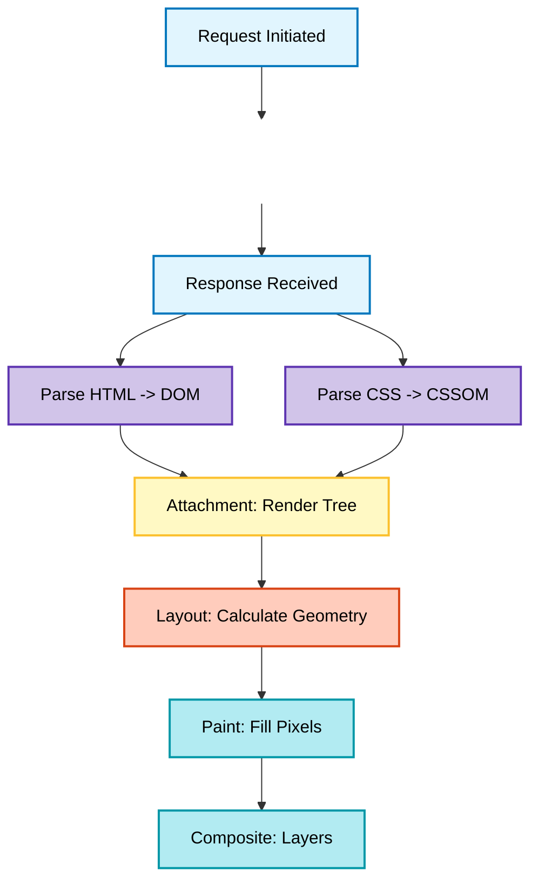

# Troubleeshooting Application Slowness by understanding Critical Rendering Path: Network Latency vs. Main Thread Execution

**Date:** 2026-01-19
**Tags:** #tech-fundamentals, #browser-mechanics, #datadog, #performance-engineering
**Related:** [[tips/datadog/rum-debugging]], [[tips/ai-workflows/debugging-assistant]]

---

### Executive Summary
"Performance Degradation" is usually a symptom of two fundamentally different bottlenecks.
1.  **I/O Bound (Network Latency):** The User Agent is idle, waiting for the upstream service.
2.  **CPU Bound (Main Thread Contention):** The User Agent is actively blocked by script execution or rendering tasks.

For Solutions Engineers, distinguishing between these states is the baseline for credible root cause analysis. This document maps the browser's **Critical Rendering Path** to specific Datadog RUM signals.

Personally, this really hlps me when I am opening a ticket with engineering, as I can share with them my initial hypothesis and supporting DataDog traces. 

---

### System Architecture: The Rendering Pipeline

The browser rendering engine is a strict dependency graph. If an upstream phase stalls, everything downstream stops.

### Phase 0: Network Latency (The Idle State)

Before rendering begins, the client must fetch resources.

* **System State:** The Main Thread is effectively idle (0% CPU) while awaiting I/O completion.
* **Engineering Implication:** If `DOMContentLoaded` is delayed but Client CPU is low, the bottleneck is **upstream** (Backend/Database). Client-side optimization (like JS minification) will yield zero improvement here.
* **Datadog Signal:** High `Time to First Byte (TTFB)` relative to total `Resource Duration`.

### Phase 1: Parsing (The Blocking State)

Upon receiving the payload, the browser parses HTML into the DOM and CSS into the CSSOM.

* **Constraint:** The HTML Parser is **synchronous**. If it hits a non-deferred `<script>` tag, it halts. The Main Thread is blocked until that script is downloaded and executed.
* **Engineering Implication:** Third-party SDKs must use `defer` to avoid blocking the `interactive` state. `Async` is risky—it downloads in parallel but interrupts parsing the moment it finishes.
* **Datadog Signal:** High `Total Blocking Time (TBT)` or `First Input Delay (FID)`.

### Phase 2: Render Tree Construction

The engine combines the DOM (Structure) and CSSOM (Style) into the Render Tree.

* **Mechanism:** The Render Tree represents only **visible** nodes.
* `display: none`: Excluded from the Render Tree.
* `visibility: hidden`: Included (it preserves geometry).

* **Engineering Implication:** If an element exists in the DOM (verified via DevTools) but isn't rendering, check if a conflicting CSS rule kicked it out of the Render Tree.

### Phase 3: The Pixel Pipeline (Layout & Composite)

The engine calculates geometry and rasterizes pixels.

1. **Layout (Reflow):** Computing coordinates. **High CPU Cost.**
2. **Paint:** Applying color/text. **Medium Cost.**
3. **Composite:** Layer assembly. **Low Cost (GPU Offloaded).**

#### Risk: Forced Synchronous Layout

Reading a geometric property (e.g., `offsetWidth`) immediately followed by writing a style (e.g., `style.width`) invalidates the layout cache. The engine is forced to perform a synchronous Reflow within a single frame.

* **Engineering Implication:** This causes **Visual Jank** (frame rate drops), often mistaken for network lag.
* **Datadog Signal:** High frequency of `Long Tasks` and elevated `Cumulative Layout Shift (CLS)`.

---

### Diagnostic Framework: Isolating the Fault Domain

**Objective:** When analyzing a "Slow Transaction" (e.g., Dashboard Load), strictly isolate the fault domain to Backend, Network, or Client.

#### 1. Data Collection & ID Correlation

Before diving into RUM, try to capture the precise Transaction Identifier as we can then use this to quickly identify the traces using DataDog's Wildcard Search. This bypasses the ambiguity of time-range searching.

> **Field Note: Retrieving the Transaction ID**
> 1. Open **DevTools** (`Cmd+Opt+I` / `F12`) -> **Network** tab.
> 2. Trigger the action in the UI.
> 3. Locate the initiating API call (e.g., `POST /api/v1/reports`).
> 4. **Crucial Step:** Inspect the **Response** body. The backend often returns the generated UUID (e.g., `report_id: "a1b2..."`) immediately.
> 5. **Usage:** Use this ID to filter Datadog Logs/Traces directly (e.g., `@report_id:a1b2...`).
> 
> For more details, refer to this TIL that talks about [how to use the response headers in the browser to get a unique identifier generated by your specific action & then use the wildcard search](browser-to-trace-bridge.md)

#### 2. Analysis Logic

Navigate to **Datadog RUM -> Sessions**, open the Waterfall, and inspect the specific `XHR`/`Fetch` resource bar.

**Scenario A: High Server Latency (Backend)**

* **Signal:** Bar is predominantly **Green** (`First Byte Time`).
* *Metrics:* TTFB: 3.0s | Download: 0.1s.

* **Diagnosis:** Request sent successfully. Upstream Service delayed the response.
* **Action:** Route to Backend Team. Investigate APM traces for slow SQL or lock contention.

**Scenario B: Bandwidth Saturation (Network)**

* **Signal:** Bar is predominantly **Blue** (`Download Time`).
* *Metrics:* TTFB: 0.2s | Download: 2.9s.

* **Diagnosis:** Server processing was nominal, but `Content-Length` is excessive for the client's bandwidth.
* **Action:** Route to API Team. Verify payload size; recommend GZIP/Brotli or Pagination.

**Scenario C: Main Thread Contention (Client)**

* **Signal:** Network metrics are nominal, but **Action Duration** is elevated.
* *Metrics:* API returns in 0.2s, but Action Duration is 3.0s.

* **Diagnosis:** Latency occurs *after* the network close. The Main Thread is blocked by expensive JS execution (JSON parsing or DOM hydration).
* **Action:** Route to Frontend Team. Analyze "Long Tasks" in the RUM timeline.

---

**Operational Outcome:**
Eliminates ambiguity in ticket routing. Performance regressions are immediately assigned to the correct engineering domain without circular discussions.
