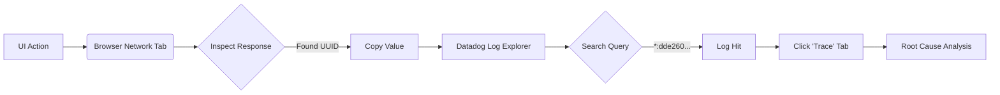
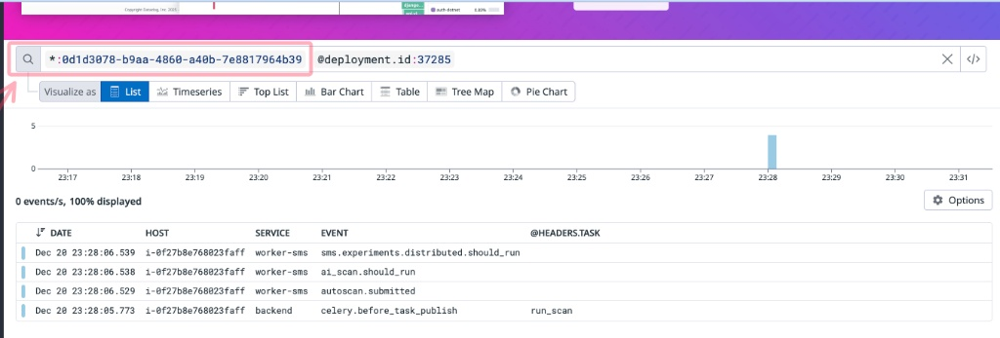

# Full-Stack Tracing: The Browser-to-Backend Bridge

**Category:** DataDog
**Tags:** #datadog #solutions-engineering #debugging #observability #devtools

## The Bottleneck
You are running a POV or debugging a customer issue. You trigger an action in the UI (e.g., "Start Scan"), and it fails or hangs. You need to see the backend trace in Datadog to understand *why*, but you are blocked by a lack of context:

1.  **Unknown Field Names:** Is the ID called `scan_id`, `task_uuid`, `repo_id`, or something else entirely?
2.  **Noise:** Searching for generic terms returns thousands of logs.
3.  **Guesswork:** You waste 15 minutes trying to correlate a timestamp.

## The Stack
* **Browser DevTools:** Chrome/Firefox Network Tab (The Source)
* **Datadog:** Log Explorer & APM (The Destination)

## The Workflow
This workflow uses the "Wildcard Bridge" technique to instantly link a specific user action to a backend trace without knowing the underlying schema.

### 1. The Capture (Browser)
First, isolate the unique identifier generated by your specific action.

1.  Open DevTools (`Cmd+Opt+I` / `F12`) and navigate to the **Network** tab.
2.  Trigger the action in the UI (e.g., create a task).
3.  Locate the relevant API call in the list.
4.  **Crucial Step:** Check the **Response** tab (not just the Payload). The backend often returns the generated ID (like a `task_id` or `scan_id`) immediately upon creation.
5.  Copy that unique UUID/value.


### 2. The Logic



### 3. The Connection (Datadog)

This is the "magic" syntax. Instead of guessing `resource_id:1234`, use the wildcard search to look across **all** indexed fields.

**The Query:**

```text
*:<your-copied-value>

```

**Example:**
If your ID is `0d1d3078-b9aa-4860-a40b-7e8817964b39`, search:
`*:0d1d3078-b9aa-4860-a40b-7e8817964b39`



### 4. The Analysis & Pro Tip
1.  **Live Tail:** If you are reproducing this live, ensure you are in "Live Tail" mode to see the log hit the moment you execute the search.
2.  **The Pivot:** Once the log entry appears, click it and look for the **Trace** tab or the "View Trace" button.
3.  This transports you from a single log line to the full APM flame graph, showing exactly which service or database query failed.

> **🔥 Pro Tip: The Quota Hack**
> If your organization has consumed its daily log indexing quota, historical search will return zero results. **Use Live Tail instead.**
>
> Live Tail streams ingestion data in real-time *before* it hits the indexing tier.
> 1. Open the Log Explorer.
> 2. Switch the time picker to **"Live Tail"**.
> 3. Enter your wildcard query (`*:UUID`).
> 4. Trigger the UI action.
>
> You will see the logs appear instantly, bypassing the retention limit block.

## The Payoff
* **Zero Schema Knowledge Required:** You don't need to ask Engineering "what is this field called in the logs?"
* **Precision:** You are debugging *your* exact request, not a random request that happened at the same time.
* **Resilience:** Works even when log retention quotas are exceeded.
* **Speed:** Reduces mean-time-to-root-cause from ~15 minutes of hunting to ~30 seconds.

> **Gotcha:** The `*:<value>` syntax only works on **indexed fields** (facets) in Datadog. However, high-cardinality IDs (like Trace IDs, Span IDs, and primary User IDs) are almost always indexed by default in mature environments.

## Appendix: Official Docs
* **Wildcard Search:** [Log Search Syntax](https://docs.datadoghq.com/logs/explorer/search_syntax/)
    * *Reference for the `*:value` syntax, boolean operators, and facet search.*
* **Real-Time Debugging:** [Live Tail](https://docs.datadoghq.com/logs/explorer/live_tail/)
    * *Documentation on streaming logs that bypass indexing retention limits.*
* **Full-Stack Context:** [Correlating Logs and Traces](https://docs.datadoghq.com/tracing/other_telemetry/connect_logs_and_traces/)
    * *How to ensure your backend injects the `trace_id` and `span_id` that makes the pivot possible.*