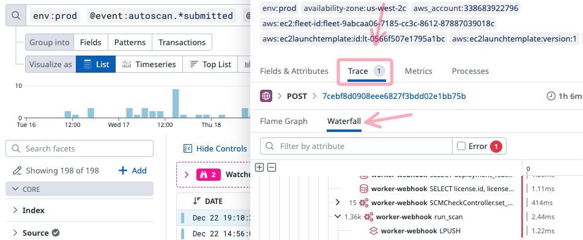

# DataDog: The Log-to-Trace Pivot (POV Debugging)

**Category:** DataDog  
**Tags:** #observability #solutions-engineering #debugging #pov  

## The Bottleneck
You are in the middle of a POV. A customer reports Semgrep scans are not happening. You jump into DataDog.
* **Logs** are great search engines (find the error), but terrible storytellers (what caused it?).
* **Traces** are great storytellers (visualize the latency/waterfall), but hard to search (finding the *specific* failed request).

Trying to find the root cause by scrolling through raw logs is a waste of time. You need to pivot.

## The Solution: The "Search & Pivot" Workflow
The fastest way to debug a SaaS application is to use Logs to **find** the needle, and Traces to **examine** it.

### 1. The Search (Logs)
Start in Log Explorer. Logs capture high-cardinality data that makes filtering easy.
* **Goal:** Isolate the specific failed request.
* **Query:** `env:prod` `@event:autoscan.*submitted` `@deployment_id:123456` `*:1234-5678-90ab-cdef`

PRO Tip: don't forget to [use the response headers in the browser to isolate a unique identifier generated by your specific action & then use the wildcard search](browser-to-trace-bridge.md) to look across all indexed fields. This is the "magic" syntax.

### 2. The Pivot (The "Glue")
Once you click on the relevant log line, don't just read the text message. Look for the **Trace** tab in the log detail drawer.
* **Why this works:** Your application injects `dd.trace_id` and `dd.span_id` into the log JSON. DataDog automatically correlates them.
* **Action:** Click the **Trace ID** or the "See Trace" button.

### 3. The Analysis (Traces)
You are now in the Flame Graph view.
* **Context:** You can see exactly which downstream service failed (e.g., was it the API Gateway, the Database, or the Auth Service?).
* **Outcome:** "It's not our app logic; the Postgres query timed out." -> Faster resolution.

## Pro Tip: The "Missing Trace" Gotcha
Sometimes you find the Log, but the "Trace" tab is greyed out or missing.

**Why?** Head-Based Sampling.
To save costs, DataDog (or your app config) often samples Traces at a lower rate than Logs (e.g., keeping 100% of logs but only 10% of successful traces). If the specific request you found in the logs wasn't "lucky" enough to be sampled for tracing, the link won't exist.

**Fix:** If debugging a critical POV issue, temporarily increase the trace sampling rate for that specific service or customer tenant to capture the full story.

## Appendix & References
* [DataDog Docs: Connect Logs and Traces](https://docs.datadoghq.com/tracing/other_telemetry/connect_logs_and_traces/)
* [Sampling Controls](https://docs.datadoghq.com/tracing/trace_pipeline/trace_retention/)